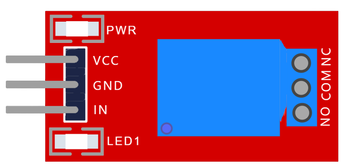

# Modulo Relay

Relay, Relevador o retransmisor

---

## Esquema

| **PIN** 	|   **DESCRIPCION**   	|
|:-------:	|:-------------------:	|
| VCC     	| Fuente de voltaje   	|
| GND     	| Tierra              	|
| IN      	| Control             	|
| NC      	| Normalmente cerrado 	|
| COM     	| Pin común           	|
| NO      	| Normalmente abierto 	|

El pin IN recibe la señal de un interruptor o en este caso el microcontrolador.

El pin NC se utiliza con la señal que se mantendra cuando el pin IN no reciba señal.

## Operación

El *Relay module* funciona como un interruptor electrónico, posee un pin de entrada **IN** que al alternar su voltaje cambia el sentido del interruptor a traves de sus pines de salida **NC** y **NO**.

texto prueba
