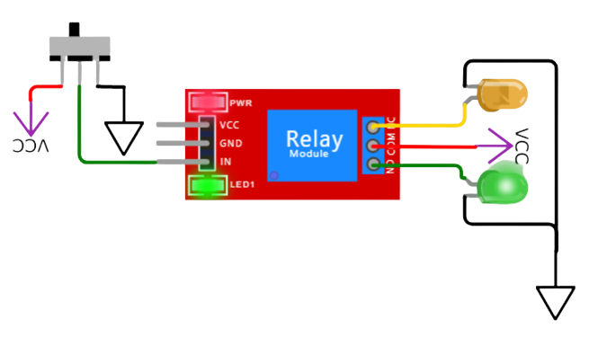
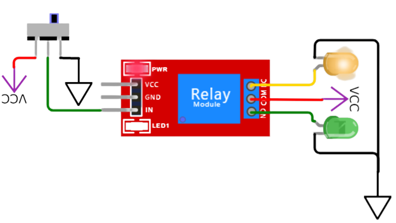

# Modulo Relay

Relay, Relevador o retransmisor

---

## Esquema

| **PIN** 	|   **DESCRIPCION**   	|
|:-------:	|:-------------------:	|
| VCC     	| Fuente de voltaje   	|
| GND     	| Tierra              	|
| IN      	| Control             	|
| NC      	| Normalmente cerrado 	|
| COM     	| Pin común           	|
| NO      	| Normalmente abierto 	|

El pin IN recibe la señal de un interruptor o en este caso el microcontrolador.

El pin NC se utiliza con la salida que se mantendra cuando el pin IN no reciba señal.

El pin NO se utiliza con la salida electrica que permanecerá cuando el pin IN registre una señal eléctrica.

---

## Operación

El *Relay module* funciona como un interruptor electrónico, posee un pin de entrada **IN** que al alternar su voltaje cambia el sentido del interruptor a traves de sus pines de salida **NC** y **NO**.

Al conectar un microcontrolador podemos controlar la señal electrica que enviamos al modulo de **relay** para alternar entre el estado de uno o de otro de los dispositivos conectados, considerando que la fuente de energía puede ser independiente a la fuente del microcontrolador, esta tendrá siempre una salida de corriente que estará alimentando a un dispositivo.

---

## Demostración

Veremos un ejemplo de ambos casos.

### Caso NO

En este ejemplo, la señal permanece constante en el pin **IN**, así pues el pin que emite señal es la salida **NO** (Normalmente Abierta), que se muestra con el LED Verde encendido y el amarillo carece de alimentación.

### Caso NC

En el segundo caso, el pin **IN** carece de señal (También podría ser un voltaje muy bajo). Por lo tanto la fuente de energía pasa al pin **NC** o Normalmente Cerrado, iluminando asi el LED amarillo.